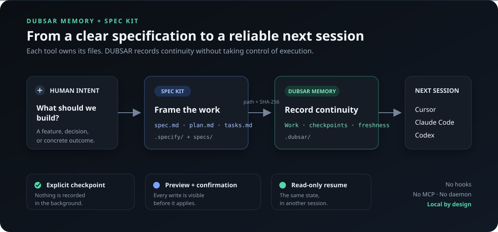
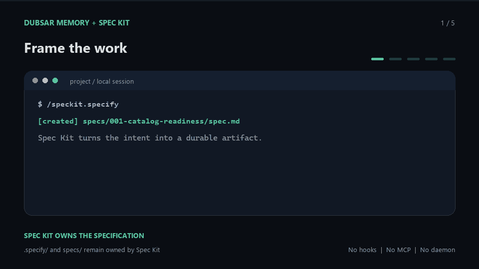

# DUBSAR Memory

[](https://github.com/kotnisofiane-bit/dubsar-memory/actions/workflows/validate.yml)
[](LICENSE)

DUBSAR Memory is a local, deterministic memory engine for long-running software
work. It stores a bounded project synthesis instead of a chat transcript, then
rebuilds the same resumable context for a person, a coding agent, a script, or
a backend service.

The first product built on the engine is **DUBSAR Continuity**: a CLI and an
optional read-only Workbench that help work move between Codex, Claude Code,
Cursor, people, machines, and sessions without inventing progress.

> **Status:** public technical preview (`0.3.0-dev`). The source is available
> under MIT. No npm package, hosted service, stable API, or production support
> commitment is announced yet.

## Why it exists

Long projects usually lose context in one of two ways: every transcript is kept
until the useful signal disappears in noise, or a handoff is written manually
and becomes stale. DUBSAR keeps a smaller record:

- what the project is;
- which Work items exist and which one is locally selected;
- the latest verified checkpoint for each Work item;
- approved Knowledge explicitly linked to that Work;
- open blockers, exact references, and the next recorded action;
- an advisory Plan/Goal recommendation when the recorded scope warrants it.

Nothing is selected, executed, completed, merged, or deployed automatically.

## What ships in this repository

| Component | Role |
|---|---|
| Memory runtime | Captures and validates `.dubsar/`, evaluates checkpoints, builds capsules and routes. |
| Continuity CLI | Stable process boundary for local tools and backend integrations. |
| Workbench | Optional technical Dashboard derived from one inspection; read-only with respect to project memory. |
| Host adapters | Two thin, optional skills for resume and checkpoint on supported coding hosts. |
| Compatibility readers | Read support for earlier Continuity Lite and legacy project formats. |

The skills are adapters, not the product core. The same CLI works without
Codex, Claude Code, Cursor, a plugin marketplace, or a global `dubsar` command.

## How it works

```text
.dubsar/ project memory
        |
        v
safe bounded snapshot -----> SHA-256 identity
        |
        v
selected Work + linked approved Knowledge + checkpoints
        |
        +-----> resume capsule / context / history
        +-----> advisory route (never auto-executed)
        `-----> read-only Workbench projection
```

The engine reads a closed set of files, rejects unsafe paths and malformed
contracts, and derives every view from the same snapshot. Canonical writes use
a preview, an exact change digest, a lock, and an atomic replacement. Inbox,
generated views, and personal memory are never project authority.

The complete storage model is documented in
[Project memory architecture](docs/MEMORY_ARCHITECTURE.md).

## Spec Kit + DUBSAR Memory

Spec Kit frames what should be built. DUBSAR records what actually happened
afterwards so another session or coding host can resume from the same bounded
state. Their authority stays separate: Spec Kit owns `.specify/` and `specs/`;
DUBSAR owns `.dubsar/` and writes only after an explicit preview and
confirmation.



The verified `0.1.4` flow creates the first project memory, active Work, and
checkpoint atomically. A later read restores the recorded next action and
checks whether the referenced specification still matches its SHA-256 digest.



[View the static final frame](docs/assets/dubsar-speckit-demo-poster.png) or read
the [Spec Kit extension guide](integrations/spec-kit/dubsar-memory/README.md).

## Quick start

Node.js 20 or newer is the only runtime prerequisite.

```bash
git clone https://github.com/kotnisofiane-bit/dubsar-memory.git
cd dubsar-memory
npm ci
npm run demo
```

Inspect the included synthetic project:

```bash
node packages/dubsar-project-continuity/bin/dubsar.mjs resume --start examples/memory-vnext-project --capsule --json
node packages/dubsar-project-continuity/bin/dubsar.mjs route --start examples/memory-vnext-project --json
node packages/dubsar-project-continuity/bin/dubsar.mjs history --start examples/memory-vnext-project --json
```

On Windows, open the optional Workbench:

```powershell
npm run workbench:open -- --start ".\examples\memory-vnext-project"
```

For a real project, follow [Getting started](docs/GETTING_STARTED.md). The
[CLI reference](docs/CLI_REFERENCE.md) separates read commands from explicit
writes.

## Using it as an engine

The supported integration boundary for this preview is the versioned JSON CLI.
A backend can invoke the packaged runtime with an absolute path, consume
`resume`, `context`, `history`, or `route`, and keep all policy and execution
authority outside DUBSAR.

DUBSAR does not require a daemon or database. It can run in a developer
worktree, a disposable worker, or a VM. It is not yet a multi-tenant knowledge
service, a vector database, a document-ingestion platform, or a replacement
for a product evidence/corpus engine.

See [Backend and host integration](docs/INTEGRATION.md).

## Workbench

The Workbench is an advanced diagnostic view, not a required daily interface.
It displays Resume, Memory, and Graph projections from the same snapshot. It
never writes `.dubsar/`, never reads Inbox content, and does not turn an
advisory route into an action.

See [Workbench guide](docs/WORKBENCH.md).

## Limits and non-goals

- no transcript ingestion or unlimited conversation storage;
- no semantic search, embeddings, model call, or network dependency;
- no branch-as-project identity, Git hook, background watcher, or daemon;
- no automatic Work selection, planning, goal activation, reviewer, or subagent;
- no claim that a checkpoint proves deployment, approval, compliance, or truth;
- bounded to 256 Work items, 256 Knowledge entries, and 128 checkpoints per
  project in the current format;
- the JavaScript module surface is still a preview; use the CLI JSON contract
  for integrations that need a durable boundary.

Read [Known limits](docs/LIMITATIONS.md) before embedding the engine in a
production system.

## Repository map

```text
packages/dubsar-project-continuity/  public memory runtime, CLI and host adapters
packages/dubsar-operator-*/          local portfolio and Workbench projections
packages/dubsar-workbench-*/         read-only Dashboard, server and launcher
examples/memory-vnext-project/       synthetic runnable project
docs/                                user and engineering documentation
tests/                               contracts, security, compatibility and UI tests
legacy/                              historical compatibility source, not packaged
```

Start with the [documentation index](docs/README.md). `PUBLIC_BOUNDARY.md`
records exactly what belongs to this public repository and what remains outside
the DUBSAR Memory product.

## License and security

The source in this repository is licensed under [MIT](LICENSE). Commercial use
is allowed. The private DUBSAR B2B Core, production connectors, Control Tower,
and proprietary routing are not part of this repository.

Do not use project memory as a secrets store. Report vulnerabilities through
GitHub private vulnerability reporting as described in [SECURITY.md](SECURITY.md).
