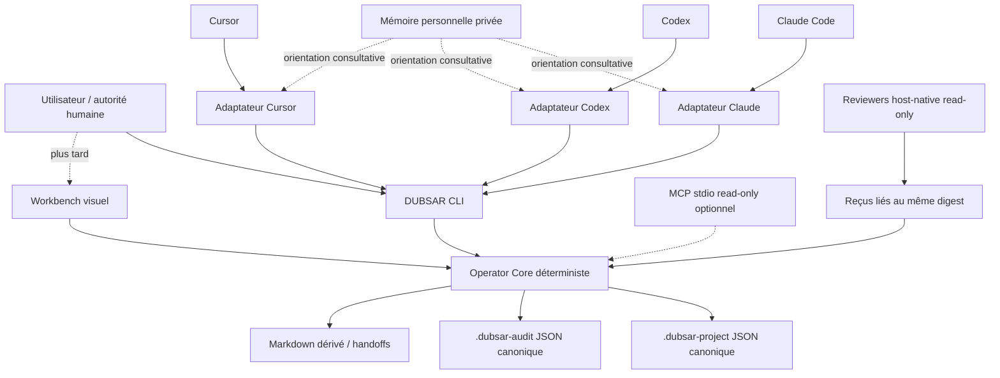

# DUBSAR Workbench autonome — étude d'architecture

**Statut :** architecture retenue ; noyau, CLI, rapport statique et pilote
loopback read-only implémentés et vérifiés ; lots d'écriture et d'intégration
encore candidats

**Date :** 2026-08-10

**Objet :** déterminer comment transformer les acquis du plugin Claude Code et de DUBSAR Local Operator en un outil autonome, utilisable sans Obsidian, Core ou Backend.

**Hors périmètre :** modification du plugin installé, ajout d'un MCP, publication, migration des workspaces, déploiement ou activation de hooks.

**État local au 2026-08-10 :** le noyau read-only, la CLI, la preuve HTML
statique et le pilote loopback transport-only sont implémentés comme tranche de
développement. Les writers, les adaptateurs et le MCP restent non implémentés
et soumis à leurs gates respectifs.

## Synthèse

La construction d'un outil DUBSAR propre est pertinente. Il doit devenir un **poste local de continuité, preuve et décision humaine**, et non un nouveau moteur général d'agents.

La meilleure direction est :

1. un noyau déterministe commun, sans dépendance à Claude, Codex, Cursor, MCP, HTTP, Obsidian ou un LLM ;
2. une CLI comme première interface et premier produit testable ;
3. une petite interface visuelle read-only seulement après preuve de la CLI et
   de sa propre frontière ; les écritures sûres restent un lot séparé ;
4. des adaptateurs hôtes minces qui portent la méthode et les rôles, mais pas la logique métier ;
5. un MCP local read-only, facultatif et tardif, uniquement si les pilotes prouvent qu'il réduit une friction multi-hôte ;
6. les JSON DUBSAR comme état canonique, le Markdown comme projection lisible et Obsidian comme option extérieure au produit.

Le plugin Claude Code est effectivement l'adaptateur DUBSAR historique le plus abouti. Il fournit de bons modèles de démarrage, diagnostic, continuité bornée, vocabulaire, contrats et tests. Il ne doit cependant pas être extrait tel quel : son autorité dépend du Core/Backend, sa surface est trop large et sa branche actuelle introduit des hooks réseau bloquants incompatibles avec les défauts du produit local.

## Ce qui a réellement été inspecté

### Plugin Claude Code installé et source actuelle

- Le cache Claude configuré contient le plugin `scribe-bridge` en version `0.13.2`.
- Le paquet installé contient 34 commandes, 2 skills, 3 hooks de continuité et un serveur MCP exposant 46 outils.
- La source actuelle du dépôt contient 513 tests réussis, des guardrails et un contrôle de paquet réussis.
- La source actuelle ajoute néanmoins `PreToolUse` et `PostToolUse` sur les outils Bash et d'édition. Le hook appelle un endpoint local, transmet une représentation de l'action et échoue fermé si le backend est absent ou inaccessible.
- Le scan « no network » ne couvre pas ce nouvel entrypoint exécutable, car `tool_evaluate.mjs` est absent de l'inventaire de fichiers contrôlés. Les tests verts ne prouvent donc pas la propriété annoncée sur toute la surface runtime.
- Plusieurs artefacts déclarent la même version `0.13.2` tout en ayant des comportements ou contenus différents : cache Claude, bundle Desktop et source courante.

### Operator léger actuel

- `packages/dubsar-local-operator` possède 13 skills et des scripts Node locaux, sans Core, Backend, MCP, hooks ou service obligatoire.
- Les workspaces `.dubsar-project` et `.dubsar-audit` sont séparés et restent les bons domaines canoniques.
- La méthode de revue consultative, les reçus liés à un digest et l'absence d'autorité du reviewer sont de bonnes bases.
- Les limites principales sont la manipulation JSON, la duplication des primitives d'I/O, l'ambiguïté entre intégrité et readiness, et l'absence d'une expérience humaine unifiée.

### Desktop existant

Le Desktop DUBSAR actuel apporte des acquis de packaging : composants épinglés, hashes, sidecars, lancement local et restrictions de navigation. Il est cependant fortement couplé au Bridge, au Backend, au superviseur de services et aux sessions DUBSAR historiques. Son code métier ne doit pas devenir la base du Workbench autonome.

## Ce qu'il faut conserver ou abandonner du plugin Claude

| Élément | Décision | Motif |
|---|---|---|
| Point d'entrée orientant | Adapter | Utiliser `locate`/`resume` sans créer de cycle de vie ou de session cachée |
| `doctor` et statuts fermés | Conserver | Rend les limites explicites et testables |
| Continuité bornée | Adapter | Utile si elle reste read-only, minimale, fail-open et opt-in |
| Contrats, Human Gates et interdiction de `VERIFIED` par le modèle | Conserver | Sépare préparation, preuve et autorité humaine |
| Adaptateur strict et sorties structurées | Conserver | Réduit l'ambiguïté entre hôtes |
| 34 commandes et 46 outils comme UX produit | Abandonner | Surface trop large, difficile à comprendre et auditer |
| Core/Backend comme autorité obligatoire | Abandonner pour le local | Contradiction directe avec l'autonomie recherchée |
| Hooks réseau Pre/PostToolUse fail-closed | Abandonner | Risque de fuite, dépendance réseau et blocage des sessions |
| Bridge et résolution par `PATH`/variables | Abandonner | Surface de substitution et provenance insuffisante |
| Plugin comme source canonique | Abandonner | Un adaptateur ne doit pas posséder la logique ou les données |

## Positionnement produit

Le Workbench répond à cinq questions, sans demander à l'utilisateur de comprendre les JSON :

1. Où en est le projet ou l'audit ?
2. Qu'est-ce qui est réellement prouvé ?
3. Qu'est-ce qui manque ou se contredit ?
4. Qu'est-ce qui bloque ?
5. Quelle décision humaine vient ensuite ?

Il ne certifie rien, n'approuve rien à la place d'une personne et n'agit pas sur des systèmes externes. Son autorité est limitée à un `local_preparation_record` : un état local reproductible qui prépare une reprise, une revue ou une décision.

## Architecture cible



### 1. Operator Core

Un modular monolith local, ESM/Node au départ, sans dépendance runtime non nécessaire. Il possède :

- découverte bornée d'un workspace explicite ;
- snapshot immuable et calcul des digests ;
- validation des schémas et des preuves ;
- carte `integrity` / `readiness` ;
- planification d'une mutation sous forme de `ChangeSet` ;
- commit avec digest attendu, écriture atomique et reçu ;
- récupération après interruption ;
- rendu Markdown dérivé ;
- diagnostic des capacités de l'hôte.

Il ne lance aucun LLM et ne connaît aucun protocole d'hôte.

### 2. CLI

La CLI est la frontière primaire et le premier MVP :

```text
dubsar locate
dubsar status
dubsar resume
dubsar doctor
dubsar validate
dubsar report
dubsar ui
```

`locate`, `status`, `resume`, `doctor`, `validate`, `report` et `ui` sont strictement read-only. `report` émet du HTML inerte sur stdout et ne choisit ni ne crée de fichier. `ui` rend ce même rapport une fois puis le transporte sur une route loopback éphémère unique, sans API ni relecture du workspace. Les mutations viennent ensuite sous des commandes distinctes avec aperçu, fichiers concernés et confirmation explicite.

Le parcours de consultation n'exige aucune édition manuelle de JSON. Tant que
le writer n'est pas approuvé, la CLI ne prétend pas fournir un parcours de
mutation autonome.

### 3. État et formats

Les espaces `.dubsar-project` et `.dubsar-audit` restent séparés. Ils partagent les primitives d'I/O et d'intégrité, pas leurs règles métier.

Le JSON reste canonique au premier cycle parce que :

- les schémas et fixtures existent déjà ;
- les validations déterministes et les reçus s'y rattachent ;
- tous les workspaces ne sont pas des dépôts Git ;
- une migration Markdown-only créerait un nouveau parseur canonique et modifierait le niveau de preuve.

Le Markdown est une projection générée et clairement marquée comme telle. Une édition directe d'un fichier dérivé doit être détectée ou écrasée seulement après avertissement explicite ; elle ne remonte jamais silencieusement vers le JSON.

Git peut versionner les workspaces, mais ne devient ni une dépendance ni un moteur transactionnel caché.

### 4. Mutations et concurrence

Gemini a justement signalé qu'un système CAS trop ambitieux pourrait recréer un petit moteur de base de données. La réponse retenue est progressive :

- au MVP read-only, aucun verrou ni journal de transaction n'est nécessaire ;
- le premier writer remplace exactement un JSON canonique existant et
  allowlisté ; les transitions multi-fichier restent refusées ;
- digest attendu, octets prospectifs validés une seule fois, fichier temporaire
  vérifié et un unique `rename` comme commit point sont obligatoires ;
- un verrou coopératif et un intent de récupération persistent jusqu'au reçu ou
  à une résolution explicite ; aucun lock stale n'est cassé automatiquement ;
- les conflits ne sont pas retentés silencieusement par un agent : ils produisent un nouvel état lisible et demandent une nouvelle proposition ;
- la garantie v1 couvre le crash de processus sur les couples
  plateforme/filesystem prouvés, pas la course finale d'un writer non
  coopératif ni la coupure de courant Windows ;
- SQLite ou un autre stockage ne sont étudiés que si une vraie atomicité
  multi-document devient irréductible. Voir `DUBSAR_TRANSACTION_WRITER_ADR.md`.

### 5. Reviewers et rôles d'agents

Les rôles produit, architecture, sécurité, vérification et fiabilité restent des reviewers natifs de l'hôte :

- brief minimal et borné ;
- lecture seule ;
- même snapshot et même digest ;
- preuve, sévérité et recommandation structurées ;
- aucun accès à la mémoire personnelle ;
- aucun vote qui efface une objection ;
- consolidation par union pessimiste des risques ;
- décision finale humaine.

Le noyau génère le plan de revue et vérifie le reçu. Il ne prétend pas qu'un reviewer est indépendant si l'hôte ne peut pas l'attester.

### 6. Adaptateurs hôtes

Les adaptateurs portent uniquement :

- les instructions et skills propres à l'hôte ;
- les alias UX utiles ;
- la déclaration réelle des capacités de revue ;
- la conversion entre appel hôte et CLI/core ;
- l'affichage du résultat.

La première intégration de validation peut cibler Claude Code, car son UX historique est la plus riche. Le contrat du noyau doit néanmoins rester neutre dès le départ ; Codex et Cursor arrivent seulement après stabilisation du premier parcours.

Les documents de capacités, manifests et tests d'adaptateurs sont générés depuis une même définition versionnée afin d'éviter la dérive observée entre README et hooks.

## Sans Obsidian

Obsidian n'est requis par aucune couche. Il est seulement un lecteur possible des Markdown.

Sans Obsidian, l'utilisateur dispose de :

- la carte d'état CLI ;
- les handoffs Markdown lisibles dans n'importe quel éditeur ;
- le pilote visuel local du Workbench ;
- les adaptateurs dans Claude, Codex ou Cursor.

La mémoire personnelle `./memory` reste une surface privée et consultative. Elle peut orienter un agent après opt-in, mais elle ne modifie pas `integrity`, `readiness`, les preuves ou les décisions. Elle n'est jamais transmise automatiquement à un reviewer, MCP ou modèle externe.

## Quelle interface visuelle ?

Le choix définitif n'est pas mûr, mais le noyau read-only et le rapport statique ont suffisamment réduit le risque pour autoriser un pilote web local réversible. La décision et ses limites sont consignées dans `DUBSAR_LOOPBACK_PILOT_ADR.md`.

| Option | Forces | Risques | Position |
|---|---|---|---|
| CLI seule | Portable, simple, testable, multi-hôte | Moins accessible pour la revue humaine | **MVP obligatoire** |
| Extension IDE | Contexte et diff natifs | Verrouillage VS Code/Cursor, ne couvre pas Claude/Codex de façon uniforme | Pilote possible |
| Web local éphémère | Léger, UI réutilisable | Surface loopback, CSRF/Origin, cycle de vie serveur | **Pilote read-only retenu** |
| Tauri avec assets embarqués | Vraie application autonome, pas de serveur localhost, capacités/CSP | Packaging Rust, signatures, IPC et maintenance multiplateforme | Candidat, pas MVP |

Gemini recommande CLI puis web local. Les revues locales convergent sur un pilote strictement transport-only après la CLI et le renderer. La décision retenue est donc de tester le web local sans le transformer en conteneur définitif ni en nouvelle couche métier.

Le choix est déclenché par les mesures :

- si les utilisateurs restent principalement dans VS Code/Cursor, tester une extension ;
- si plusieurs hôtes ont besoin de la même vue, comparer Tauri et web local ;
- si la CLI et les handoffs suffisent, ne pas construire d'UI.

Si Tauri est choisi, il réutilise seulement les acquis de packaging du Desktop existant : assets embarqués, CSP restrictive, capabilities minimales, sidecar étroit, aucune ressource distante et aucune logique métier frontend.

## Rôle exact de MCP

MCP n'est ni la mémoire, ni le moteur, ni l'autorité. C'est un transport permettant à un hôte compatible d'appeler les mêmes fonctions locales que la CLI.

Une première version éventuelle expose seulement :

```text
locate
status
validate
doctor
```

Contraintes : `stdio`, racine fixée au démarrage, read-only, schémas exacts, taille d'entrée/sortie plafonnée, aucun réseau, shell, subprocessus, secret ou backend. Il reste absent du chemin critique et remplaçable par la CLI.

Le MCP ne passe en développement que si un pilote démontre une baisse mesurée des erreurs ou du temps d'intégration par rapport à l'appel CLI.

## Packaging et identité

Organisation logique :

```text
operator-core
operator-cli
adapter-claude
adapter-codex
adapter-cursor
operator-ui          # après gate
operator-mcp         # après gate, absent par défaut
```

Chaque release est produite depuis un seul commit et publie :

- version produit ;
- commit source ;
- digest de l'artefact ;
- version du protocole ;
- versions de schémas ;
- manifeste complet des fichiers ;
- capacités effectives : lecture, écriture, réseau, hooks et hôtes.

Une version identique avec un digest runtime différent est refusée. Les caches, bundles et installateurs indexent `version + digest`, jamais seulement `version` ou `latest`.

## Trajectoire proposée

### Lot 0 — Hygiène de release et contrat d'autorité

- nouvelle identité de version pour toute différence sémantique ;
- provenance, manifest et digest uniques ;
- contrat `local_preparation_record` ;
- inventaire automatique de tous les entrypoints exécutables ;
- concordance bloquante entre capacités, manifests, documentation et runtime.

### Lot 1 — Noyau read-only et CLI — complété

- extraire découverte, snapshot, validation et rendu ;
- ajouter `integrity` et `readiness` ;
- fournir `locate`, `status`, `resume`, `doctor`, `validate` ;
- supprimer le JSON manuel du parcours principal ;
- corpus d'evals sur routage, abstention, état vide, injection et contradiction.

### Lot 2 — Premier parcours mutable — candidat, contrat draft

- `ChangeSet` et aperçu ;
- une cible canonique existante, digest attendu et Buffer confirmé immuable ;
- un remplacement par `rename` comme commit point et reçu secondaire ;
- récupération explicite ancien/nouveau/inconnu et tests de collision/crash ;
- aucun retry automatique d'une proposition LLM périmée.

### Lot 3 — Adaptateur Claude pilote

- reprendre l'UX de reprise et de `doctor`, sans lifecycle `start` ;
- conserver seulement les hooks de continuité prouvés, read-only, fail-open et opt-in ;
- exclure Bridge, Core, Backend et hooks réseau du profil local ;
- tester l'installation propre et le parcours visible par l'utilisateur.

### Lot 4 — Codex, Cursor et reviewers

- adaptateurs issus du même contrat ;
- matrice de capacités réelle ;
- reviewers read-only liés au digest ;
- mesure des erreurs, temps de reprise et compréhension.

### Lot 5 — Gate interface visuelle — pilote read-only complété

- comparer CLI, extension IDE, web local et Tauri sur un parcours réel ;
- choisir seulement si la vue réduit nettement le temps ou les erreurs ;
- commencer read-only ;
- aucune logique métier dupliquée dans l'UI.

### Lot 6 — Gate MCP

- prototype seulement si une friction multi-hôte persiste ;
- quatre outils read-only ;
- test de conformance identique à la CLI ;
- abandon si la valeur mesurée est marginale.

## Gates mesurables

| Gate | Critère |
|---|---|
| État | 0 workspace vide ou incomplet annoncé comme prêt |
| Reprise | état, blocker et prochaine décision compris en moins de 60 secondes |
| Lecture | 0 écriture par `status`, `resume`, `doctor`, `validate` ou reviewer |
| UX | 0 JSON manuel sur le parcours principal |
| Routage | au moins 95 % sur 40 scénarios, 100 % d'abstention hostile bornée |
| Déterminisme | même snapshot = mêmes sorties mécaniques et même digest |
| Mutation | 0 corruption sur 100 collisions ou interruptions avant extension du writer |
| Review | 100 % des constats liés au même digest, 0 objection effacée par consensus |
| Packaging | installation propre et identité `version + digest` cohérente sur chaque hôte |
| UI | réduction démontrée du temps ou des erreurs par rapport à CLI + handoff |
| MCP | réduction démontrée de la friction d'intégration, sans nouvelle autorité |

## Décision recommandée

**GO constaté pour le noyau, la CLI, le rapport statique et le pilote loopback
read-only. Le writer reste NO-GO tant que son contrat draft n'est pas approuvé.**

Il ne faut aujourd'hui ni forker directement le plugin Claude, ni construire
Tauri, ni installer un MCP, ni introduire SQLite, ni unifier projet et audit.
Le prochain travail matériel est l'étude puis la revue du writer transactionnel,
pas son implémentation automatique.

Le premier livrable pertinent — noyau read-only, CLI, rapport et transport
loopback éphémère — est maintenant réalisé comme pilote local. Cette verticale
prouve la valeur sans reproduire le poids du Core/Backend ou du Desktop
historique. La distribution finale et le choix d'un MCP restent entièrement
réversibles.

## Réconciliation des revues

Les reviewers produit, architecture et sécurité convergent sur le noyau déterministe, la CLI-first, l'autorité locale limitée, les adaptateurs minces, la mémoire séparée et MCP tardif. Ils ont aussi identifié comme prérequis la correction de l'identité de release et la couverture réelle des entrypoints exécutables.

Gemini 3.6 Flash a utilement contesté Tauri trop tôt, la coexistence JSON/Markdown et la complexité d'un CAS généralisé. Sont retenus : CLI seule au MVP, UI sous gate, Markdown strictement dérivé et transactions limitées aux writers réels. Ne sont pas retenus : Git comme stockage canonique obligatoire et suppression de toute protection de concurrence, car tous les workspaces ne sont pas Git et plusieurs agents ou synchronisations peuvent modifier le même état.

## Sources

### Preuves locales

- `../scribe-claude-code-plugin/README.md`
- `../scribe-claude-code-plugin/hooks/hooks.json`
- `../scribe-claude-code-plugin/hooks/tool_evaluate.mjs`
- `../scribe-claude-code-plugin/scripts/plugin_guardrails.mjs`
- `../scribe-claude-code-plugin/tests/source_invariants.test.mjs`
- `../scribe-claude-code-plugin/governance/operator-product.v1.json`
- `packages/dubsar-local-operator/README.md`
- `packages/dubsar-local-operator/skills/dubsar-local-operator/SKILL.md`
- `docs/DUBSAR_OPERATOR_VNEXT_STUDY.md`
- `../scribe-canvas-shell/desktop/src-tauri/`

### Documentation officielle

- [OpenAI — Plugin architecture](https://developers.openai.com/plugins/concepts/plugins)
- [OpenAI — Skills](https://developers.openai.com/plugins/concepts/skills)
- [OpenAI — MCP server](https://developers.openai.com/plugins/concepts/mcp-server)
- [Anthropic — Claude Code plugins reference](https://code.claude.com/docs/en/plugins-reference)
- [Anthropic — Hooks](https://code.claude.com/docs/en/hooks)
- [Anthropic — MCP](https://code.claude.com/docs/en/mcp)
- [Tauri — Capabilities](https://v2.tauri.app/security/capabilities/)
- [Tauri — Content Security Policy](https://v2.tauri.app/security/csp/)
- [Tauri — Sidecars](https://v2.tauri.app/develop/sidecar/)
