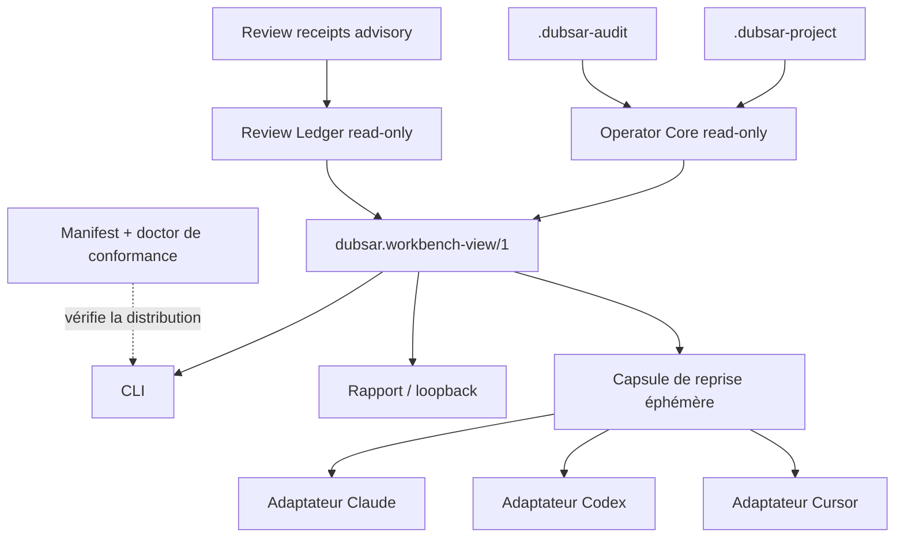

# DUBSAR Workbench — registre de complétude et audit de récupération

**Date :** 2026-08-10
**Statut :** pilote read-only et gel de conformance local GO ; release NO-GO
**Autorité :** document consultatif ; aucune approbation de release, de writer, de publication ou de déploiement

## Conclusion

Le noyau utile est déjà assez petit : environ 102 Ko de sources pour le core,
la CLI, le renderer et le serveur loopback. Il n'est pas nécessaire de remettre
Tauri, le Core, le Backend, le Bridge ou le MCP historique autour de lui.

Il reste toutefois quatre mécanismes de l'ancien produit qui valent d'être
récupérés sous une forme beaucoup plus étroite :

1. une identité de distribution `version + commit + digest + capacités` ;
2. un doctor de conformance et un probe de clean install qui rapportent sans
   réparer ;
3. une projection read-only des reçus de reviewers, de leur fraîcheur et de
   leurs objections ;
4. une capsule de reprise éphémère, bornée et dérivée du read model pour les
   adaptateurs Claude, Codex et Cursor.

Le meilleur ordre n'est donc pas « writer puis adaptateurs ». Il est :

```text
figer la preuve du Workbench
    → afficher les revues consultatives
    → tester des adaptateurs passifs read-only
    → décider séparément du writer
    → mesurer si un MCP apporte encore quelque chose
```

## Gel de conformance local observé

Le contrat `contract-workbench-conformance-v1` a été explicitement approuvé
pour l'implémentation locale read-only le 2026-08-10. Il a produit :

- `WORKBENCH_CONFORMANCE.json`, capture locale non certifiante de 24 fichiers
  et quatre composants à la version `0.1.0-dev` ;
- un checker à racines fixes qui relit les octets par handles stables, compare
  métadonnées, identités, formats liés à des producteurs publics fixes, effets
  déclarés et gate AST indépendant ;
- cinq sorties JSON golden byte-exactes et un test structurel fermé de
  `doctor` ;
- une sonde source-bundle hermétique sans installation, archive, capacité
  réseau Node directe ni route `ui`, avec environnement minimal, racine locale
  non synchronisée comme précondition, fixtures synthétiques allowlistées par
  taille/digest et sorties/temps bornés.

Le root digest observé est
`ade8cd894c40926e429a407d1ff8f4c92181304a1a34043d2bd4e43dd995a539`.
Il identifie seulement les octets locaux observés : ce n'est ni une signature,
ni une provenance Git, ni une approbation de release. Comme les quatre arbres
étaient non suivis, cette capture ne prouve pas indépendamment leur identité
historique avant le lot.

## État observé

| Surface | État | Preuve locale | Écart restant |
|---|---|---|---|
| Operator Core | GO pilote | snapshot borné, digests raw-byte, `integrity` séparé de `readiness` | package privé et non lié à une identité de release |
| CLI | GO pilote | `locate`, `status`, `resume`, `validate`, `doctor`, `report`, `ui` | `resume` reste une vue ; aucun cycle de vie `start` ne doit être inventé |
| Rapport HTML | GO pilote | rendu déterministe, script-free, borné et échappé | pas encore de golden de release commité |
| Loopback | GO transport-only | route capability unique, `127.0.0.1:0`, limites Host/Origin/temps/connexions | pas une authentification OS et pas une API d'adaptateur |
| Runtime gate Workbench | GO borné | graphe AST Acorn, quatre racines, entrypoints atteignables et capacités fermées | contrôle statique, pas sandbox formelle |
| Conformance Workbench | GO local, NO-GO release | inventaire exact de 24 fichiers, root digest, identités/formats recoupés, goldens et source-bundle probe | source `working_tree`, commit nul, revue digest-bound absente |
| Local Operator | GO développement | inventaire exact, treize skills, aucune intégration Core/MCP/hook | provenance `draft/pending`, release volontairement fermée |
| Gate public des packs | GO développement, NO-GO release | imports, réexports et imports dynamiques analysés par AST ; chargeurs et globals réseau usuels couverts par régression | contrôle statique, pas sandbox formelle ; release Local Operator toujours bloquée par `PB100` |
| Reçus de reviewers | GO comme données consultatives | fichiers immuables liés au root digest et classés par rôle/isolation | non lus par le Workbench, donc objections invisibles dans l'UI |
| Writer | NO-GO | ADR et contrat mono-fichier disponibles | contrat toujours `draft`, aucune autorisation d'implémentation |
| Adaptateurs hôtes | absent | architecture documentée | aucun package Claude/Codex/Cursor Workbench ni clean install |
| MCP | absent par décision | gate de valeur documenté | aucune friction mesurée ne le justifie encore |

Validation fraîche sur le snapshot de travail : Node `v24.18.0`, 132 tests
réussis, 0 échec et 1 fixture symlink ignorée par les permissions du profil
Windows. Les gates de développement, runtime et conformance passent. Le gate
de release exécute bien les deux contrôles et échoue pour deux frontières
indépendantes : `PB100` sur la provenance pending du Local Operator, puis
`SOURCE_NOT_COMMITTED`, `COMMIT_BLOB_PROOF_MISSING`, `HUMAN_REVIEW_PENDING` et
`SOURCE_BUNDLE_PROBE_NOT_RELEASE_EVIDENCE` sur le Workbench. Sous Windows,
`WINDOWS_REPARSE_ATTRIBUTES_UNPROVEN` reste aussi explicite : Node refuse les
symlinks, junctions visibles et hardlinks, mais n'expose pas tous les tags
reparse/cloud-placeholder.

Les quatre packages Workbench, leurs tests et leur gate sont encore non suivis
par Git dans le snapshot courant. Les résultats prouvent donc un état local,
pas encore un commit immuable ou une release reproductible.

## Ce qu'il faut récupérer

### KEEP — maintenant

#### 1. Manifeste de conformance Workbench

Créer un manifeste distinct du registre de plugins. Il décrit uniquement :

- les quatre packages Workbench ;
- leurs versions, entrypoints et fichiers atteignables ;
- les effets réellement observés ;
- le commit source et les digests de fichiers/artefacts ;
- les versions des formats et du read model ;
- un statut de review qui reste `pending` jusqu'à validation humaine.

Ce manifeste ne devient ni une couche runtime ni une abstraction métier. Il
sert à empêcher qu'une même version désigne deux comportements différents.

#### 2. Doctor de conformance

Reprendre la grammaire de l'ancien `operator_doctor` et du clean-install probe :

- états fermés `ok`, `warn`, `fail`, `unknown`, `blocked` ;
- cause, propriété non prouvée et prochaine action sûre ;
- séparation `declared` / `observed` ;
- rapport seulement, sans réparation, installation ou lancement ;
- aucune lecture de secret et aucun chemin absolu dans la sortie.

Le doctor reste une preuve structurelle. Il ne prétend pas que le projet, un
audit ou un hôte distant est sain.

#### 3. Méthodes de preuve et clean install

Réutiliser les méthodes, pas les runtimes historiques :

- goldens déterministes pour les sorties CLI ;
- fausse home ou répertoire temporaire hermétique ;
- copie allowlistée sans `.git`, tests, cache ou `node_modules` produit ;
- deux générations comparées par SHA-256 ;
- refus d'un entrypoint non inventorié ou d'une capacité non déclarée ;
- installation propre testée séparément pour chaque hôte ciblé.

#### 4. Read model Eyes et diagnostics

Conserver le chemin unique :

```text
JSON canonique → snapshot → évaluation → dubsar.workbench-view/1 → rendu
```

L'UI ne recalcule jamais un verdict. Les patterns visuels utiles sont le Mission
header, Overview/Evidence/Decisions, les états honnêtes, les diagnostics et les
couvertures catégorielles. Le JavaScript et le HTML historiques ne sont pas
réutilisés.

### ADAPT — lot suivant

#### 5. Review Ledger read-only

Les reçus `dubsar.review-receipt/1` existent déjà. Le Workbench peut les lire
avec une allowlist, des limites et un digest, puis afficher :

- rôle et catégorie d'isolation déclarée ;
- root digest examiné ;
- état `current` ou `stale` par rapport au snapshot courant ;
- constats, alternatives et limitations ;
- réconciliations sans effacer les objections initiales.

La distinction suivante est impérative :

- une contradiction présente dans les JSON canoniques affecte déjà
  `readiness` ;
- une objection contenue seulement dans un reçu reste consultative et ne
  modifie pas `integrity` ou `readiness` ;
- l'UI doit la nommer `advisory review finding`, jamais `canonical blocker` ;
- seule une promotion humaine explicite dans le format canonique peut la rendre
  bloquante.

Ainsi, il n'existe pas de double vérité : le statut canonique et l'état de revue
consultatif sont deux champs distincts et honnêtement étiquetés.

#### 6. Adaptateurs passifs

Le premier adaptateur hôte ne possède aucun cycle de vie `start`, aucune
session cachée et aucun hook. Il fait seulement :

```text
appel explicite → CLI/read model → capsule bornée → affichage par l'hôte
```

La capsule est produite à la demande, jamais stockée comme nouvelle mémoire.
Elle contient seulement identité de format, domaine, root digest, état,
blocker, prochaine action et références bornées. Aucun transcript, mémoire
personnelle, chemin absolu, URL privée ou contenu brut n'y entre.

Si l'adaptateur lance la CLI, son manifeste doit déclarer cette exécution locale
au lieu de prétendre `process_execution: none`.

### ADAPT — plus tard seulement

- **Source records :** conserver digest, complétude, redaction et
  `authoritative:false`, mais supprimer connecteur, query, URI, identités
  personnelles et timestamps non nécessaires avant de versionner un nouveau
  format.
- **Control packs :** uniquement comme catalogues JSON immuables, versionnés et
  digérés. Aucun script, verdict automatique ou règle exécutable déguisée en
  donnée.
- **Deliverable profiles :** seulement après qu'un besoin de plusieurs rendus
  humains est mesuré ; ils ne doivent jamais changer le contenu canonique.

### REJECT — définitivement pour ce Workbench

- Core, Backend, Bridge, activation, bearer et superviseur de services ;
- Tauri, Rust, IPC WebView et bundle Python/Node embarqué au MVP ;
- hooks `PreToolUse` / `PostToolUse`, particulièrement avec réseau ou
  fail-closed ;
- MCP historique, daemon, orchestration de sessions et commande installée via
  modification du `PATH` ;
- JavaScript des anciennes pages HTML, `innerHTML` et contrôles d'exécution UI ;
- worktrees Git, Claude headless et runners Hermes dans le produit local ;
- mémoire personnelle comme source d'autorité ou contexte automatique d'un
  reviewer.

## Architecture cible après audit



Le Review Ledger ajoute une projection consultative. Il ne change pas les JSON
canoniques et ne transforme pas un reviewer en autorité.

## Ordre recommandé

### Lot A — freeze Workbench evidence

1. Lier les fichiers Workbench à un commit borné et revu, après autorisation.
2. **Terminé localement :** `DUBSAR_WORKBENCH_CONFORMANCE_CONTRACT.md` borne un
   manifeste séparé et `pending`, son checker, les goldens et le source-bundle
   probe sans utiliser le contrat writer.
3. **Terminé localement :** remplacer l'analyse regex du public-boundary gate
   par le parseur AST déjà verrouillé. Les imports statiques, réexports, imports
   dynamiques et alias usuels de chargeur/réseau sont couverts par une fixture
   adversariale ; ce gate reste un contrôle statique et non une sandbox.
4. **Terminé localement :** goldens byte-exacts pour `status`, `validate`,
   `report`, une erreur fermée et un audit avec contradiction ; `doctor` est
   contrôlé par schéma exact et semver runtime exact.
5. **Terminé comme sonde source-bundle :** copie allowlistée Node hermétique et
   read-only. Elle ne prétend pas être un `npm install` propre ni prouver la
   route loopback.
6. Aligner la documentation avec la CLI réelle : pas de commande `start` au
   pilote.

### Lot B — Review Ledger

1. Inventorier et lire les reçus avec limites de taille, profondeur et nombre.
2. Lier chaque reçu à son root digest et calculer seulement `current` / `stale`.
3. Projeter les constats dans un champ advisory distinct.
4. Tester qu'une objection consultative n'altère jamais le statut canonique et
   qu'une contradiction canonique continue de bloquer `readiness`.

### Lot C — adaptateur read-only pilote

1. Choisir un seul hôte pour le pilote.
2. Générer une capsule éphémère depuis `dubsar.workbench-view/1`.
3. Exposer seulement reprise et doctor ; aucun `start`, hook, background service
   ou writer.
4. Mesurer compréhension, temps d'intégration et erreurs avant les deux autres
   hôtes.

### Lot D — writer, sous autorisation séparée

Le contrat mono-fichier reste draft. Aucun travail des lots A à C ne doit
l'activer implicitement.

### Lot E — gate MCP

Un MCP stdio read-only n'est étudié que si le pilote d'adaptateur montre une
friction que la CLI et la capsule ne résolvent pas.

## Écarts de complétude

| Objectif | État | Action requise |
|---|---|---|
| Release/provenance Operator | partiel | approbation humaine et clean install multi-hôte |
| Identité du Workbench | capture locale complète | commit, preuve des blobs et revue humaine liée au digest |
| Core/CLI/read model | prouvé localement | goldens et identité de distribution |
| Rapport/loopback | prouvé localement | clean install et test de compréhension humaine |
| Revue multi-agent visible | partiel | Review Ledger read-only |
| Adaptateurs hôtes | absent | pilote passif sur un hôte |
| Writer | draft | approbation explicite puis preuves crash/filesystem |
| MCP | non justifié | mesure comparative après adaptateur |
| Reprise en moins de 60 s | non mesuré | test utilisateur borné |
| Routage ≥ 95 % / 40 scénarios | non mesuré | corpus d'evals offline |
| Réduction d'erreurs UI vs CLI | non mesurée | pilote comparatif |
| Runtime supporté | incohérent | aligner `>=20`, matrice 20/22 et cible writer 22/24 |
| TypeScript | non implémenté | conserver ESM au pilote ou décider une migration séparée |

## Réconciliation Gemini et revues locales

Gemini a utilement contesté deux risques : un adaptateur `start/resume` pourrait
recréer une orchestration cachée, et une contradiction affichée ne doit pas
coexister avec un statut canonique prétendument identique. La décision retenue
est donc un adaptateur passif et deux états explicitement séparés : canonique et
consultatif.

Ses recommandations de fermer immédiatement la release, supprimer le gate AST
et bannir tout manifeste multi-hôte ne sont pas retenues : la release exige une
approbation humaine qui ne peut pas être synthétisée ; le reviewer sécurité a
identifié un contournement concret du gate regex, désormais reproduit puis fermé
par analyse AST et test de régression ; enfin une dérive réelle entre source,
cache et bundle justifie un manifeste minimal de distribution. Ce
manifeste ne devient ni un runtime ni une abstraction métier.

Les revues architecture, sécurité et vérification convergent sur le Lot A avant
toute nouvelle capacité. Le writer, le MCP, les control packs et les nouveaux
formats métier restent hors de ce lot.
