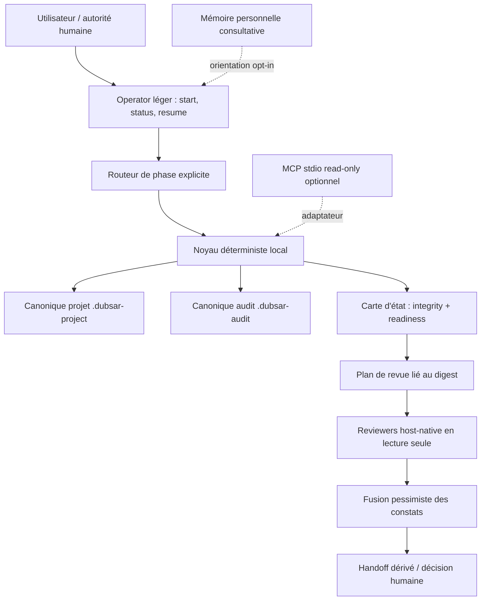

# DUBSAR Local Operator vNext — étude d'architecture

**Statut :** recommandation candidate, non approuvée pour implémentation

**Date :** 2026-08-09

**Périmètre :** plugin local public, skills de continuité et de préparation d'audit, reviewers locaux, mémoire et éventuel MCP

**Hors périmètre :** déploiement, connexion au Core/Backend DUBSAR, automatisation de décisions humaines, publication d'une nouvelle version

**Mise à jour au 2026-08-10 :** cette étude initiale a conduit au noyau
read-only, à la CLI, au rapport HTML et au pilote loopback désormais implémentés
et vérifiés. La recommandation historique « commencer par le Lot 1 » est donc
acquise. Le prochain lot candidat est le writer transactionnel, avec un contrat
encore draft et aucune autorité d'implémentation.

## Décision proposée

La prochaine version doit devenir plus forte par la **qualité de ses preuves et la réduction des ambiguïtés**, pas par l'ajout immédiat de composants.

La trajectoire recommandée est :

1. mesurer le comportement actuel avec un corpus d'évaluations hors ligne ;
2. distinguer explicitement l'intégrité technique de la préparation métier ;
3. rendre les mutations locales atomiques, comparables et vérifiables ;
4. orchestrer des reviewers en lecture seule sur un snapshot immuable, sans leur donner de pouvoir de décision ;
5. ne construire un MCP qu'en adaptateur optionnel si un besoin multi-hôte réel est démontré ;
6. garder la mémoire personnelle séparée, consultative et facultative.

Le premier lot ne doit ajouter ni base de données, ni daemon, ni backend, ni dépendance réseau.

## Thèse produit

DUBSAR Local Operator n'est pas un « système d'exploitation pour agents ». C'est un **protocole local de continuité et de préparation d'audit** qui aide un agent à :

- retrouver un travail significatif sans inventer son état ;
- distinguer faits, intentions, preuves, lacunes et décisions humaines ;
- préparer une décision reproductible à partir d'artefacts locaux ;
- solliciter des angles de revue indépendants sans leur déléguer l'autorité ;
- produire un handoff lisible et déterministe.

Les utilisateurs prioritaires sont le mainteneur technique d'un projet long ou risqué, le responsable d'une automatisation qui prépare une revue, et le reviewer humain qui doit comprendre l'état, le blocage et la prochaine décision.

## État observé

Le paquet `packages/dubsar-local-operator` réunit actuellement :

- 13 skills, soit les 12 skills spécialisés/umbrella et le routeur Operator ;
- 16 scripts Node.js déterministes ;
- deux espaces canoniques séparés : `.dubsar-project` et `.dubsar-audit` ;
- des reçus de revue immuables et liés à un digest ;
- une politique de revue consultative, sans vote ni certification ;
- aucune dépendance réseau ou MCP obligatoire ;
- une taille locale d'environ 0,16 Mo et des validations moyennes proches de 66 ms ;
- une liste de descriptions de skills d'environ 3 789 caractères, sous le budget de découverte recommandé par Codex ;
- 44 contrôles observés lors de la préparation de cette étude : 43 réussis, aucun échec et un test de symlink ignoré sur Windows.

Cette base est déjà solide, mais elle ne prouve pas encore une installation publique reproductible. La provenance de l'Operator et les installations propres Codex, Claude et Cursor restent des gates de release.

## Lacunes prioritaires

### P0 — Un workspace valide peut paraître prêt alors qu'il est vide

Le vocabulaire actuel `validated | absent | blocked` mélange deux axes :

- **integrity** : fichiers présents, schémas valides, références cohérentes, digests intacts ;
- **readiness** : mission suffisamment cadrée, preuves suffisantes, blockers connus, revue requise obtenue, décision humaine possible.

Un workspace vide peut être structurellement valide sans être prêt. Cette ambiguïté doit disparaître de l'interface et des tests.

### P0 — Le routage n'est testé que syntaxiquement

Le test actuel vérifie surtout que les noms des skills apparaissent dans le contrat de routage. Il ne mesure pas :

- le choix à partir d'une demande naturelle ;
- l'abstention quand aucune phase ne correspond ;
- les demandes ambiguës ou contradictoires ;
- les tentatives d'injection ;
- l'absence d'activation automatique de la phase suivante.

### P0 — L'intégrité des preuves projet est plus faible que celle de l'audit

Dans la continuité projet, certaines références d'artefacts restent des chaînes déclaratives. Elles ne sont pas toujours résolues vers un fichier borné et lié à un digest comme dans le flux audit. La validation doit distinguer une référence déclarée d'une preuve effectivement résolue.

### P0 — Les écritures ne sont pas encore transactionnelles

Les contrôles `lstat`/`realpath`, la lecture et l'écriture sont des opérations séparées. Deux agents ou une synchronisation cloud pourraient modifier un fichier entre la validation et l'écriture. Les protections requises sont :

- un seul writer à la fois ;
- un digest attendu avant mutation ;
- un snapshot unique pour la validation et la revue ;
- écriture dans un fichier temporaire privé puis renommage atomique ;
- récupération explicite après interruption ;
- tests de concurrence, collision et crash.

### P0 — La revue est bien décrite, mais pas entièrement attestée

Les reçus portent un rôle et un mode d'isolation, mais ces champs restent déclarés dans le payload. Pour une garantie plus forte, l'hôte ou le coordinateur doit attester les capacités réellement utilisées. Le reviewer doit rester sans écriture, sans réseau, sans mémoire personnelle et sans outil d'action.

### P1 — Le parcours humain demande encore trop de manipulation JSON

Le produit a besoin d'un point d'entrée orienté résultat :

- `start` pour créer ou proposer le bon workspace ;
- `status` pour afficher une carte d'état ;
- `resume` pour reprendre sans écrire ;
- `doctor` pour diagnostiquer les limites de l'hôte et les incohérences ;
- des helpers de proposition pour ajouter une preuve ou préparer une mise à jour sans modifier silencieusement le canonique.

## Architecture cible

### 1. Hiérarchie d'autorité

1. Les permissions de l'utilisateur et du sandbox bornent toute action.
2. Les JSON canoniques et les preuves résolues décrivent l'état du workflow.
3. Les scripts déterministes calculent l'intégrité et les gates mécaniques.
4. Les reviewers produisent des constats consultatifs liés au même digest.
5. Le Markdown, le chat, Obsidian et la mémoire personnelle orientent ; ils ne valident rien.
6. La décision ou l'approbation humaine reste explicite et extérieure aux reviewers.

### 2. Noyau déterministe

Le noyau doit être écrit une fois, puis empaqueté de manière reproductible dans les packs autonomes. Il porte :

- découverte bornée des workspaces ;
- lecture sûre et snapshot immuable ;
- validation de schéma et d'intégrité ;
- résolution optionnelle stricte des preuves ;
- transitions avec digest attendu ;
- écriture atomique et reprise après interruption ;
- rendu Markdown dérivé ;
- enregistrement de reçus immuables ;
- diagnostic de capacités de l'hôte.

Les deux domaines projet et audit gardent leurs schémas et répertoires séparés. Le partage concerne les primitives d'I/O et d'intégrité, pas leur sémantique métier.

### 3. Graphe de workflow statique

Les 12 skills restent la couche de méthode. Leurs phases et gates doivent être décrites dans un graphe déclaratif simple, avec peu de branches, utilisé par le routeur, les validations et les tests.

Le graphe ne déclenche jamais automatiquement une phase sensible. Il propose la prochaine étape, explique son prérequis et attend l'intention ou la gate humaine requise.

### 4. Mesh de revue borné

Le plan de revue dépend du risque matériel : produit, architecture, sécurité, vérification ou fiabilité. Pour chaque revue :

- un brief minimal et autoportant ;
- un snapshot et un digest identiques ;
- un reviewer en lecture seule ;
- des constats structurés avec sévérité, preuve et recommandation ;
- au plus un challenger pour une décision matérielle ;
- aucune boucle ouverte de débat entre modèles.

La fusion des constats est **pessimiste et déterministe** : les alertes sont réunies, jamais lissées par un vote ou un consensus LLM. Le principal explique les désaccords, mais seul l'humain tranche les gates humaines.

### 5. Harness d'évaluations hors ligne

Le harness doit contenir des fixtures versionnées et synthétiques pour :

- routage naturel et demandes ambiguës ;
- abstention et hors-périmètre ;
- faux états « terminé » ou « approuvé » ;
- contradictions entre sources ;
- références de preuve absentes, changées ou trop grandes ;
- prompt injection et faux changement de rôle ;
- workspace corrompu, symlink/junction et sortie de racine ;
- collision de writers, interruption et reprise ;
- installation propre sur Codex, Claude et Cursor.

Un score d'évaluation mesure un comportement ; il ne devient jamais une approbation ou une certification.

### 6. Mémoire et Obsidian

La mémoire personnelle `./memory` reste séparée des workspaces DUBSAR :

- lecture facultative et explicitement demandée ;
- orientation, apprentissages et historique, jamais autorité ;
- aucun envoi aux reviewers, à un MCP ou à un modèle externe ;
- aucune ingestion récursive ou promotion automatique ;
- revalidation des faits vivants contre les sources canoniques.

Obsidian est seulement une vue humaine du Markdown. Il n'est requis ni par les skills, ni par le noyau, ni par le futur MCP. Un utilisateur peut employer n'importe quel éditeur ou aucun outil graphique.

Les mémoires natives de l'hôte peuvent compléter le rappel personnel, mais ne doivent pas entrer dans le calcul de l'intégrité ou de la readiness.

### 7. MCP optionnel et séparé

Un MCP n'est justifié que si plusieurs hôtes ont réellement besoin de la même interface d'outils vivants. Sa première version éventuelle doit rester :

- locale en `stdio` ;
- explicitement enracinée sur un workspace au démarrage ;
- sans TCP, shell, réseau, secret ou backend ;
- en lecture seule : `locate`, `status`, `validate`, `doctor` ;
- incapable d'écrire dans les JSON canoniques ;
- remplaçable par la CLI et absent du chemin critique.

Les validations actuelles prennent environ 66 ms. La performance ne justifie donc pas un serveur persistant. Le MCP doit résoudre une friction d'intégration mesurée, pas une hypothèse.

## Comparaison des options

| Option | Valeur | Coût/risque | Décision candidate |
|---|---|---|---|
| Skills + scripts renforcés | Autonome, portable, explicable, hors ligne | Duplication d'implémentation si le noyau n'est pas généré | **Base recommandée** |
| Sous-agents host-native | Angles indépendants, bruit sorti du contexte principal | Tokens, latence, métadonnées d'isolation parfois déclaratives | **Oui, borné par le risque** |
| Mémoire personnelle | Continuité humaine et apprentissage | Biais, fraîcheur, fuite vers les reviewers | **Privée, opt-in, consultative** |
| MCP local read-only | Interface uniforme entre hôtes | Nouvelle surface d'installation et de confiance | **Plus tard, sous gate** |
| SQLite/WAL | Transactions et concurrence plus fortes | Migration, dépendance et abandon du Markdown/JSON portable | **Non tant que le FS échoue pas aux tests** |
| Git comme base d'état | Historique et adressage par contenu éprouvés | Tous les utilisateurs/workspaces ne sont pas des dépôts ; UX et concurrence cloud complexes | **Preuve/versionnage, pas moteur caché** |
| Core/Backend DUBSAR | Gouvernance distante et capacités live | Couplage, authentification, disponibilité, changement de produit | **Hors périmètre du plugin local** |

## Plan par lots et portes Go/No-Go

### Lot 0 — Fermer proprement la preuve v0.2

**Livrables**

- provenance humaine du paquet Operator ;
- inventaire et manifests recalculés ;
- installation propre dans Codex, Claude et Cursor ;
- ajout de l'Operator au gate de release racine ;
- documentation claire du niveau de preuve atteint.

**Go si** les trois installations propres chargent les skills attendus, les validations restent vertes et aucun fichier non inventorié n'entre dans le paquet.

**No-Go si** la release dépend du worktree historique ou si l'un des hôtes exige un chemin non documenté.

### Lot 1 — Baseline cognitive et carte d'état

**Livrables**

- corpus initial d'au moins 40 scénarios ;
- `status`/`resume` sans écriture ;
- séparation `integrity` / `readiness` ;
- `doctor` en lecture seule ;
- une carte indiquant état, preuves, blocker, prochaine décision et capacité de l'hôte.

**Go si** le routage atteint au moins 95 %, l'abstention est parfaite sur le corpus hostile borné, aucun workspace vide n'est présenté comme prêt, et une reprise typique produit un état compréhensible en moins de 60 secondes.

**No-Go si** l'amélioration exige une nouvelle source canonique ou si l'Operator écrit pendant `status`, `resume` ou `doctor`.

### Lot 2 — Intégrité transactionnelle

**Livrables**

- noyau I/O partagé et généré dans les packs ;
- snapshot immuable ;
- verrou exclusif court et digest attendu ;
- écriture temporaire puis renommage atomique ;
- résolution stricte et opt-in des preuves projet ;
- tests de collision, interruption et changement de preuve.

**Go si** aucune corruption n'est observée dans 100 scénarios d'interruption/collision, si un conflit échoue fermé avec un diagnostic récupérable et si les packs restent autonomes.

**No-Go si** les différences Windows/macOS/Linux ne peuvent pas être bornées. Dans ce cas seulement, ouvrir une ADR SQLite ou autre stockage transactionnel.

### Lot 3 — Revue multi-angle attestée

**Livrables**

- plan de revue par matérialité ;
- capacités hôte explicites : `independent`, `self-check` ou `none` ;
- reçus attestés par le coordinateur quand l'hôte le permet ;
- fusion pessimiste des constats ;
- fallback documenté sans reviewer disponible.

**Go si** un même snapshot et les mêmes constats donnent toujours le même résultat mécanique, aucun reviewer ne modifie le workspace, toutes les alertes restent visibles et le coût médian ne dépasse pas le budget fixé par le pilote.

**No-Go si** le produit doit prétendre à une isolation que l'hôte ne peut attester ou si la revue déclenche une boucle ouverte.

### Lot 4 — Pilotes multi-hôtes

**Livrables**

- parcours réels de continuité et d'audit ;
- mesures de compréhension, erreurs, temps de reprise et manipulations JSON ;
- matrice des différences Codex/Claude/Cursor ;
- décisions de compatibilité documentées.

**Go si** au moins 80 % des pilotes identifient correctement l'état, le blocker et la prochaine décision, et si les manipulations JSON manuelles diminuent d'au moins 50 %.

**No-Go si** l'expérience ne surpasse pas clairement les deux packs utilisés séparément.

### Lot 5 — Gate MCP

Construire un prototype MCP uniquement si les pilotes démontrent une friction multi-hôte récurrente que la CLI et les skills ne résolvent pas.

**Go si** le MCP passe tout le corpus du Lot 1, reste strictement read-only, n'élargit pas la racine et réduit un indicateur mesuré d'installation ou d'intégration.

**No-Go** dans tous les autres cas.

### Lot 6 — Gate mémoire privée

Étudier un bridge privé uniquement après stabilisation du noyau, avec sélection explicite, minimisation, expiration et promotion humaine. Il reste hors du paquet public et hors des reviewers.

## Métriques de succès

| Surface | Mesure |
|---|---|
| Routage | ≥ 95 % sur au moins 40 demandes versionnées |
| Abstention hostile | 100 % sur le corpus borné d'injection/hors-périmètre |
| Fausse readiness | 0 workspace vide ou incomplet présenté comme prêt |
| Reprise | état utile en moins de 60 s, sans écriture ni nouvel identifiant |
| Déterminisme | mêmes entrées structurées = mêmes sorties dérivées |
| Intégrité | 0 corruption sur 100 scénarios de collision/interruption |
| Revue | 100 % des constats liés au même digest ; 0 mutation reviewer |
| Portabilité | installation propre validée sur les trois hôtes ciblés |
| UX | -50 % de manipulations JSON ; ≥ 80 % de compréhension en pilote |
| Autorité | 0 claim automatique d'approbation, conformité ou exécution humaine |

## Risques à surveiller

- construire un moteur de workflow général au lieu d'un protocole borné ;
- faire de la réconciliation LLM un consensus ou un vote ;
- confondre résultat d'évaluation et certification ;
- ajouter SQLite, Git caché ou MCP avant d'en avoir une preuve de besoin ;
- laisser la mémoire personnelle influencer une validation ;
- synchroniser un workspace pendant une écriture sans détecter le conflit ;
- faire confiance à un rôle ou un mode d'isolation seulement parce qu'il est écrit dans un reçu ;
- rendre le produit techniquement complet mais humainement incompréhensible.

## Recommandation de démarrage

Le prochain lot à proposer est le **Lot 1 : corpus d'évaluations + carte `integrity/readiness` + `doctor` read-only**.

Il offre le meilleur rapport valeur/risque : il mesure d'abord le vrai comportement, corrige l'ambiguïté la plus importante et améliore immédiatement la reprise, sans migration de données ni nouvelle frontière de confiance. Le Lot 2 ne commence qu'après cette baseline.

## Revue contradictoire

Les reviewers produit, architecture et sécurité ont convergé sur une architecture skills/scripts renforcée, des reviewers host-native bornés, une mémoire privée séparée et un MCP tardif.

Gemini 3.6 Flash a utilement signalé trois risques : transformer le plugin en moteur de workflow général, employer une réconciliation LLM qui lisse les alertes, et sous-estimer les conflits des dossiers synchronisés. Sa recommandation de donner la priorité absolue aux evals et d'utiliser une fusion pessimiste est retenue.

Gemini proposait SQLite/WAL ou Git comme stockage dès la prochaine phase. Cette partie n'est pas retenue à ce stade : elle ajouterait une migration, une dépendance et une complexité non justifiées par les performances actuelles. La décision reste réversible : si les tests du Lot 2 montrent que les primitives de fichiers ne satisfont pas les critères d'intégrité multiplateforme, une ADR comparera alors SQLite, Git et d'autres options.

## Sources

### Preuves locales

- `packages/dubsar-local-operator/README.md`
- `packages/dubsar-local-operator/PROVENANCE.json`
- `packages/dubsar-local-operator/skills/dubsar-local-operator/SKILL.md`
- `packages/dubsar-local-operator/skills/dubsar-local-operator/references/routing-contract.md`
- `packages/dubsar-local-operator/skills/dubsar-local-operator/references/review-lenses.md`
- `packages/dubsar-local-operator/skills/dubsar-project-continuity/references/review-protocol.md`
- `packages/dubsar-local-operator/skills/dubsar-audit-readiness/references/review-protocol.md`
- `tests/operator-routing.test.mjs`
- `tests/review-receipts.test.mjs`
- `RELEASE_CHECKLIST.md`

### Documentation officielle OpenAI consultée

- [Plugin architecture](https://developers.openai.com/plugins/concepts/plugins)
- [Skills](https://developers.openai.com/plugins/concepts/skills)
- [MCP server](https://developers.openai.com/plugins/concepts/mcp-server)
- [Build skills](https://learn.chatgpt.com/docs/build-skills)
- [Build plugins](https://learn.chatgpt.com/docs/build-plugins)
- [Subagents](https://learn.chatgpt.com/docs/agent-configuration/subagents)
- [Memories](https://learn.chatgpt.com/docs/customization/memories)
- [AGENTS.md](https://learn.chatgpt.com/docs/agent-configuration/agents-md)
- [MCP in Codex](https://learn.chatgpt.com/docs/extend/mcp)
