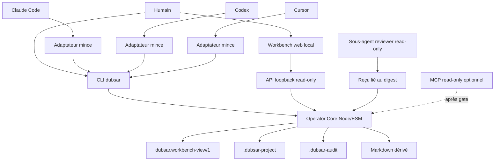

# DUBSAR Workbench — audit de réemploi

**Date :** 2026-08-10
**Statut :** audit de réemploi terminé ; pilote read-only local implémenté et vérifié
**Autorité :** étude locale consultative ; aucun résultat d'audit, aucune certification et aucune approbation de production
**Suite de :** `DUBSAR_STANDALONE_WORKBENCH_ARCHITECTURE.md`

**Registre de complétude :** `DUBSAR_WORKBENCH_COMPLETION_LEDGER.md`

## Verdict

Il y a davantage à récupérer que le Launcher UI, mais le réemploi doit être **asymétrique** :

1. le **Local Operator** devient le noyau déterministe ;
2. **Eyes** apporte la frontière de lecture et le langage de l'interface ;
3. le **Desktop** fournit seulement des patterns visuels, de diagnostic, de processus et de packaging ;
4. le **plugin Claude** fournit les parcours `start`, `resume`, `doctor`, le contexte borné et les contrats multi-agent ;
5. Tauri, Core, Backend, Bridge, les anciens hooks réseau, le runtime de sessions et le MCP historique restent hors de la cible.

La découverte la plus importante est Eyes :

```text
fichiers canoniques
      ↓
Operator Core
      ↓
read model versionné
      ↓
renderer HTML / API locale
```

L'interface ne calcule jamais un état, un gate ou un verdict. Elle rend une projection déjà calculée par le noyau. Ce principe est explicite dans `src/eyes/eyes-boundary.js:5-11` et `docs/EYES_ORCHESTRATION_SHELL_READ_MODEL.md:10-21`.

## Matrice de réemploi

### KEEP — conserver la logique

| Actif | Valeur conservée | Cible |
|---|---|---|
| Workspaces `.dubsar-project` et `.dubsar-audit` | JSON canonique, Markdown dérivé et séparation stricte des deux domaines | Operator Core |
| Découverte bornée, validation, digests et rendus déterministes | Reprise fiable et état reproductible | Operator Core |
| Reçus de revue liés au digest | Challenge consultatif sans transférer l'autorité au reviewer | Operator Core et adaptateurs |
| Eyes `provider → normalize → render` | Frontière moteur/interface et états négatifs honnêtes | Read model Workbench |
| Mission header, vues Overview/Evidence/Decisions, couverture catégorielle | Compréhension rapide sans score trompeur | Workbench UI |
| UX de reprise et `doctor` | Un point d'entrée explicite, un diagnostic fermé et une seule prochaine action | CLI et adaptateurs |
| Sorties bornées, environnement minimal, aucun shell | Modèle d'exécution sûre lorsqu'un adaptateur appelle la CLI | Adaptateurs |
| Manifest allowlisté, pins et agrégats SHA-256 | Base du futur packaging reproductible | Release |
| Tests d'honnêteté, limites et chemin de données unique | Invariants à porter dans le nouveau noyau | Evals et CI |

### ADAPT — reprendre le principe, réécrire l'implémentation

| Actif | Adaptation obligatoire |
|---|---|
| Deux copies de `safe-io.mjs` | Un module commun avec limites d'octets, profondeur, cardinalité et longueur, schémas exacts, ouverture par handle et contrôle post-ouverture |
| Modèle projet actuel | Séparer explicitement `integrity`, `readiness`, `blockers` et `next_action`, comme le modèle audit le fait déjà |
| Pages Desktop | Petits composants HTML/CSS rendus depuis le read model ; aucun ancien JavaScript, `innerHTML` ou appel Tauri |
| Cockpit et session cards | Remplacer Bridge/Backend/PID/launch par mission, lot, preuve, contradiction, décision humaine et prochaine action |
| `resume` et `doctor` Claude | Réécrire le vocabulaire autour du workspace local ; retirer cycle de vie `start`, activation, access, Core et Backend |
| Reçus multi-agent | Ajouter digest du snapshot, identifiant/version d'adaptateur et afficher l'isolation comme déclarée tant qu'elle n'est pas attestée par l'hôte |
| Packaging Canvas | Produire un artefact Node-only avec version, commit, manifest de capacités et digest ; ne pas reprendre Rust/Tauri |
| Écritures futures | V1 mono-fichier : `ChangeSet`, preview, digest attendu, Buffer unique, temp vérifié, `rename` comme commit point, lock coopératif et récupération explicite |

### REJECT — ne pas importer dans le Workbench

- Tauri, WebView IPC, crates Rust et installateurs natifs au MVP.
- Superviseur Bridge/Backend, activation, bearer persistant et autorité Core.
- Python session-runtime, Git worktrees, Claude headless et Hermes runner.
- Launcher `scribe-mcp` qui installe une commande et modifie le `PATH` utilisateur.
- MCP historique à 46 outils et Bridge adapter.
- Hooks réseau `PreToolUse` / `PostToolUse`, en particulier leur défaut fail-closed.
- Site Astro, formulaires, données personnelles et endpoints externes ; seuls des tokens CSS/assets audités peuvent être extraits.
- JavaScript des anciennes pages HTML et leurs contrôles d'exécution.
- Graphe d'orchestration complet, exécution parallèle et contrôle de sessions au P0.

## Points récupérables qui avaient été sous-estimés

### 1. Le read model Eyes

Eyes est plus utile que le cockpit lui-même. Il définit :

- des états fermés et honnêtes ;
- trois vues du même snapshot : Overview, Evidence et Decisions ;
- une Mission en trois zones : identité, état/prochaine action, alerte/décision ;
- une couverture `covered / partial / missing / blocked`, jamais un faux score ;
- une timeline déterministe ;
- la règle « projection pour affichage, jamais source de vérité ».

Le nouveau contrat devrait s'appeler, par exemple, `dubsar.workbench-view/1`. Il est dérivé des JSON canoniques mais versionné séparément afin que l'UI puisse évoluer sans migrer les données métier.

### 2. Les diagnostics opérateur

Les pages d'erreur Desktop et `scribe-doctor` ont une bonne grammaire : code fermé, cause, ce qui n'a pas été fait, une action sûre et un diagnostic copiable. Ce modèle doit devenir commun à la CLI et à l'interface.

### 3. Le packaging et les invariants de processus

Le Desktop contient de bons principes malgré son poids : composants épinglés, copie allowlistée, manifestes et hashes. `session-view` montre aussi comment borner stdout, imposer un timeout, réduire l'environnement et éviter le shell. Ces principes se portent en Node ; les runtimes Rust/Python ne se portent pas.

### 4. Le parcours multi-hôte

Le plugin Claude reste la meilleure preuve UX pour un adaptateur : démarrer, reprendre, diagnostiquer et injecter un contexte très court. Codex et Cursor doivent consommer le même noyau et le même read model, sans recopier la logique. Les reviewers restent des sous-agents read-only liés au même digest.

## Risques découverts

### P0 — provenance et release incohérentes

- La source Claude conserve la version `0.13.2` alors que les capacités observées diffèrent entre la source, le cache installé et le bundle Desktop.
- `packages/dubsar-local-operator` est maintenant inventorié par le registre et
  contrôlé par `check:release`, qui échoue correctement sur `PB100` tant que sa
  provenance reste `draft/pending`. Les quatre packages Workbench ont désormais
  une capture locale exacte, mais restent hors de toute identité de release
  approuvée : source `working_tree`, commit nul et revue liée au digest absente.
- La vérification locale de `scribe-canvas-shell/SHA256SUMS.txt` donne **4 entrées correctes, 5 fichiers absents et 35 hashes divergents**.

Conséquence : aucun Workbench ne doit être distribué depuis cet état. Le Lot 0 doit imposer une source propre, une version nouvelle pour toute différence de capacité, un inventaire complet et l'identité `version + digest`.

### P0 — les tests verts ne couvrent pas toute la surface exécutable

Le plugin passe 513 tests et ses guardrails, mais `hooks/hooks.json` enregistre `hooks/tool_evaluate.mjs` tandis que l'inventaire « no network » ne scanne que les trois hooks de continuité. Le futur gate doit dériver automatiquement tous les entrypoints depuis les manifests et refuser tout entrypoint non classifié.

### P0 — ancienne UI non réutilisable telle quelle

Dans `desktop/ui/session-runtime.html`, `esc()` n'échappe pas les guillemets (`:98`) puis une valeur locale est injectée dans `data-dsn="..."` via `innerHTML` (`:203-218`). Il faut réécrire le renderer avec `createElement`, `textContent` et propriétés DOM. Aucun état utilisateur ne doit entrer dans du HTML assemblé.

### P1 — serveur loopback = vraie frontière de sécurité

L'interface web locale reste légère, mais elle n'est pas gratuite en sécurité. Pour `dubsar ui` :

- bind exclusif sur `127.0.0.1`, port aléatoire et arrêt sur inactivité ;
- `Host` et `Origin` exacts, aucun CORS et refus de `Origin: null` ;
- assets empaquetés allowlistés, MIME exact et aucune exposition directe du workspace ;
- CSP sans script inline, pas de service worker, ressource distante, iframe ou stockage de contenu ;
- GET sans effet ; mutations séparées, digest attendu, confirmation humaine et protection CSRF ;
- aucun chemin absolu, secret ou contenu privé dans URL, historique ou logs.

Le loopback ne constitue pas à lui seul une authentification du système d'exploitation.

### P1 — entrées locales insuffisamment bornées

Les primitives actuelles refusent traversal et symlinks et utilisent des créations exclusives : c'est une bonne base. Elles lisent toutefois des JSON sans plafond global et les validateurs ne ferment pas encore toutes les tailles, profondeurs, cardinalités et clés. Ces limites sont obligatoires avant de servir un workspace au navigateur.

## Architecture retenue



Le noyau est une bibliothèque Node/ESM sans HTTP, MCP, UI, hôte agent ou réseau. La CLI, le serveur local et les adaptateurs sont des façades. Une dépendance runtime de validation n'est pas nécessaire au premier lot : les schémas exacts et les built-ins Node suffisent. Le gate de développement utilise toutefois un parseur AST unique et verrouillé, car les tests adversariaux ont démontré que des regex ne pouvaient pas prouver les bindings en lecture seule.

## Trajectoire allégée

### Lot 0 — remettre la release à zéro

- Capture locale Workbench `dubsar.workbench-conformance/1`, checker indépendant,
  goldens et source-bundle probe : ils décrivent les octets courants. Les quatre
  arbres étant non suivis par Git, leur identité historique pré-lot n'est pas
  prouvée indépendamment par cette capture.
- Commit propre et provenance approuvée du Local Operator.
- Nouvelle identité de version et digest.
- Inventaire automatique des fichiers, entrypoints et capacités.
- Inclusion du Local Operator dans `check:release`.
- Reproduction fresh-install sur les hôtes visés.

### Lot 1 — noyau read-only et read model — complété

- `locate`, `snapshot`, `validate`, `evaluate`, `render`.
- `integrity` séparé de `readiness`.
- Contrat `dubsar.workbench-view/1`.
- CLI `dubsar status|resume|doctor --json`.
- Limites, schémas fermés, redaction et tests adversariaux.

### Lot 1.5 — preuve UI statique — complété

Ajouter `dubsar report`, qui émet uniquement le HTML sur stdout. Un appelant peut choisir explicitement de le rediriger vers `workbench-status.html`; la CLI ne possède aucun writer. Ce rapport autonome, read-only et sans serveur prouve le chemin complet : JSON canonique → read model → renderer. Il permet de tester la compréhension humaine avant d'ouvrir la frontière loopback.

Cette étape n'est pas le produit final ; elle réduit simplement le risque de l'interface dynamique.

### Lot 2 — vraie fenêtre web locale — pilote complété

- `dubsar ui --root <workspace>`.
- Serveur `node:http` éphémère, read-only et same-origin.
- Pages P0 : Overview, Evidence, Decisions et Diagnostics.
- Réutilisation des tokens visuels et du Mission header, pas des scripts historiques.
- Pas de graphe, PWA, daemon ou packaging natif au P0.

### Lot 3 — écritures transactionnelles — candidat, contrat draft

- Preview et `ChangeSet`.
- Exactement un JSON canonique existant et allowlisté.
- Détection coopérative par digest ; aucune promesse de CAS contre un writer externe.
- Remplacement complet ancien/nouveau et récupération de crash testée.
- Confirmation TTY explicite mais non authentifiée contre le même compte OS.
- Aucun backup ou undo automatique ; voir `DUBSAR_TRANSACTION_WRITER_ADR.md`.

### Lot 4 — adaptateurs Claude, Codex et Cursor

- Générés depuis un contrat de capacités commun.
- Même CLI, même read model et même digest.
- reprise contextuelle et `doctor` seulement au pilote ; aucun cycle de vie
  `start`, session cachée ou hook.
- Reviewers read-only avec objections conservées.

### Lot 5 — gate MCP

Un MCP n'est ajouté que si les pilotes démontrent une friction réelle que la CLI et les adaptateurs ne résolvent pas. Le premier prototype serait stdio, read-only, sans daemon et avec quatre outils maximum : `status`, `resume`, `evidence_gaps`, `doctor`.

## Gates Go / No-Go

| Gate | Critère minimal |
|---|---|
| Autorité | `local_preparation_record` uniquement ; aucune certification ou autorité Core implicite |
| État | 0 workspace vide/incomplet annoncé prêt |
| Déterminisme | même snapshot = même read model, même rendu mécanique et même digest |
| Lecture | 0 écriture et 0 réseau sortant par `status`, `resume`, `doctor`, `report` et reviewer |
| UI | l'interface ne recalcule aucun verdict et aucun contenu local n'entre dans du HTML actif |
| Sécurité loopback | tests Host/Origin/CSRF, DNS rebinding, XSS, traversal, symlink, DoS et multi-instance verts |
| Mutation | 0 corruption sur 100 scénarios de collision ou interruption avant d'activer le writer |
| Packaging | version, commit, capacités, fichiers et digest cohérents sur clean install multi-hôte |
| UX | mission, blocker et prochaine décision compris en moins de 60 secondes |
| MCP | valeur mesurée supérieure à son coût de sécurité et de maintenance |

## Priorité produit

Le périmètre le plus fort et le plus léger est :

```text
Operator Core
+ CLI
+ read model Eyes
+ rapport HTML statique
+ Workbench loopback read-only
```

Le Launcher UI peut servir d'inspiration visuelle, mais **son launcher Rust/PATH n'est pas la base**. Au départ, `dubsar` est simplement une commande Node explicite. Un binaire autonome ou Node SEA reste une décision de distribution ultérieure, lorsque le noyau est stabilisé.

Ordre de grandeur pour un ingénieur senior : **18 à 26 jours** pour le MVP read-only CLI + Workbench, puis **5 à 8 jours supplémentaires** si la première release doit déjà embarquer Node ou produire des artefacts natifs multiplateformes. Cette estimation doit être recalibrée après le Lot 1.5.

## Réconciliation des revues

Les revues produit, architecture et sécurité convergent sur le même noyau et sur le rejet de Tauri/Core/Backend. La contribution utile de Gemini est double : versionner un read model UI séparé des JSON canoniques, puis intercaler un rapport HTML statique avant le serveur loopback.

Trois suggestions n'ont pas été retenues :

- créer les workspaces projet et audit ensemble, car cela violerait leur séparation de domaine ;
- ajouter une dépendance au runtime produit pour la validation métier, car les built-ins et schémas fermés suffisent encore ; le parseur AST du gate de développement constitue une exception séparée, motivée par un bypass reproduit et verrouillée dans `package-lock.json` ;
- supprimer tout concept d'agent, car les reviewers et adaptateurs restent utiles, à condition de ne jamais entrer dans le noyau ni recevoir d'autorité.

## Validation et limites

- Plugin Claude : 513 tests réussis, guardrails et contrôle de paquet réussis, avec la limite d'inventaire décrite plus haut.
- Agent skills et tranche Workbench : 132 tests réussis, 1 test symlink ignoré
  par le profil Windows, 0 échec. Le gate de développement et la conformance
  locale passent ; le gate de release échoue intentionnellement sur `PB100` et
  sur l'absence de commit, preuve de blobs et revue humaine liée au root digest.
- La sonde Workbench prouve la copie et l'exécution CLI depuis les 24 fichiers
  allowlistés avec une fausse home, un environnement minimal et dix fichiers de
  fixtures synthétiques liés à des tailles et SHA-256 exacts. Elle n'est pas un
  test `npm install`, ne lance pas `ui` et ne prouve pas un package multi-hôte
  installable.
- Sous Windows, les reparse points génériques et placeholders cloud que Node ne
  sait pas distinguer d'un fichier ordinaire restent `unproven`. Le checker
  refuse les symlinks, junctions visibles, hardlinks et alias physiques, mais
  ne revendique pas l'absence de toute hydratation implicite.
- Aucun build Tauri/Rust, test navigateur E2E, clean install multi-hôte, déploiement, commit ou changement de configuration n'a été exécuté.
- Le dossier de préparation `.dubsar-audit` contient l'inventaire, les actions sensibles, quatre artefacts de preuve hashés et la revue structurée.

Cette étude et les preuves du pilote préparent les décisions humaines suivantes.
Elles ne constituent ni un audit indépendant complet, ni une certification, ni
une autorisation d'implémenter le writer ou de publier.

## Documentation externe utile

- Node.js, serveur HTTP : <https://nodejs.org/api/http.html>
- Node.js, Single Executable Applications : <https://nodejs.org/api/single-executable-applications.html>
- MDN, `showDirectoryPicker()` et disponibilité limitée : <https://developer.mozilla.org/en-US/docs/Web/API/Window/showDirectoryPicker>
- Microsoft Edge, installation d'une PWA : <https://learn.microsoft.com/en-us/microsoft-edge/progressive-web-apps/how-to/>

SEA et PWA ne font pas partie du MVP ; ces sources servent uniquement à garder les options de distribution futures explicites.
